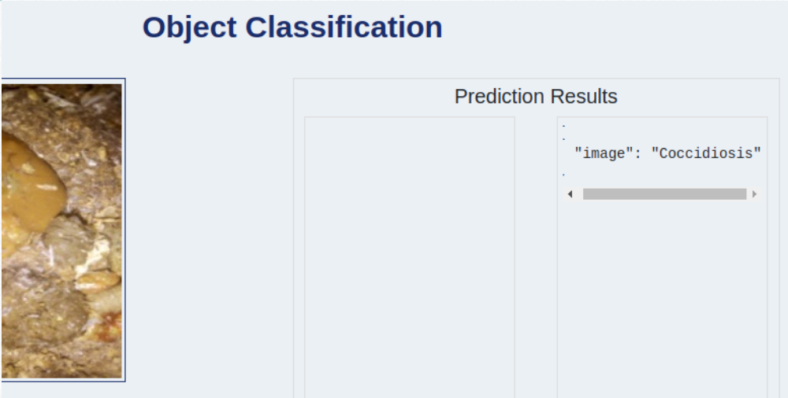
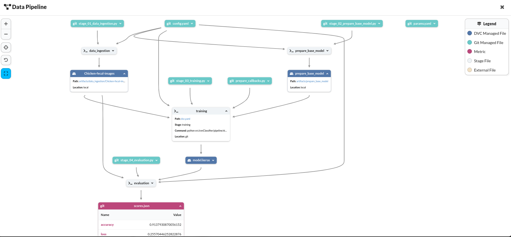
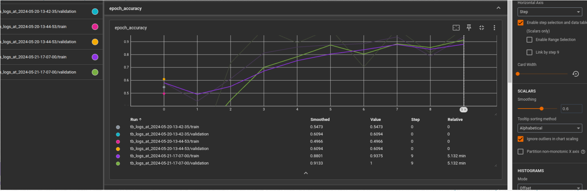

# chicken-disease-classification

 - End-to-end project CNN based project, also demonstrating the MLOps practices, along with deployment.
 - This project aims to classify chicken fecal samples into two categories: diseased(Coccidiosis) and healthy. The classification is based on analyzing images of the fecal samples using computer vision techniques.


## App Link: 
https://chickenreg.azurewebsites.net/




## Project Structure

The project follows a modular structure, consisting of several stages and pipelines which includes :-

1. `stage_01_data_ingestion.py`: This stage is responsible for data ingestion. It includes functions for downloading, extracting, and preprocessing the dataset.
2. `stage_02_prepare_base_model.py`: In this stage, the base model for the classification task is prepared. It involves loading a pre-trained model, modifying it if necessary, and preparing it for training.
3. `stage_03_training.py`: The training stage is responsible for training the model using the prepared dataset. It includes functions for data augmentation, model training, and saving the trained model.
4. `stage_04_evaluation.py`: This stage focuses on evaluating the performance of the trained model. It includes functions for loading the trained model, performing inference on test data, and calculating evaluation metrics.




## Dependencies

To run this project, you need the following dependencies:

- Python (version 3.8 or above)
- TensorFlow 
- Flask 
- DVC 

Make sure you have installed the required dependencies before running the project.


## Workflows

1. Update config.yaml
2. Update secrets.yaml [Optional]
3. Update params.yaml
4. Update the entity  # to create some return type/classes
5. Update the configuration manager in src config
6. Update the components
7. Update the pipeline 
8. Update the main.py
9. Update the dvc.yaml


# How to run?
### STEPS:

Clone the repository

```bash
git clone https://github.com/satyamsc0/chicken-disease-classification
```
### STEP 01- Create a virtual environment after opening the repository

```bash
python -m venv venv
```

```bash
source venv/bin/activate
```


### STEP 02- install the requirements
```bash
pip install -r requirements.txt
```


```bash
# Finally run the following command
python app.py
```

Now,
```bash
open up you local host and port
```


### DVC cmd

1. dvc init
2. dvc repro
3. dvc dag


### Tensorboard:
```bash
tensorboard --logdir artifacts/prepare_callbacks/tensorboard_log_dir/
```



# AZURE-CICD-Deployment-with-Github-Actions

## Save pass:
EZKH5yytiVnJ3h+eI3qhhzf9q1vNwEi6+q+WGdd+ACRCZ7J


## Run from terminal:

docker build -t chickenreg.azurecr.io/chicken:latest .

docker login chickenreg.azurecr.io

docker push chickenreg.azurecr.io/chicken:latest


## Deployment Steps:

1. Build the Docker image of the Source Code
2. Push the Docker image to Container Registry
3. Launch the Web App Server in Azure 
4. Pull the Docker image from the container registry to Web App server and run 


## About MLflow & DVC

MLflow

 - Its Production Grade
 - Trace all of your expriements
 - Logging & taging your model


DVC 

 - Its very lite weight for POC only
 - lite weight expriements tracker
 - It can perform Orchestration (Creating Pipelines)


## Conclusion

This project demonstrates the classification of chicken fecal samples as diseased or healthy using computer vision techniques. The modular structure and the use of pipelines make it easy to follow and reproduce the workflow. The Flask app provides a user-friendly interface for interacting with the classification model.

For more details, refer to the individual implementation files and comments within the code.


### Extended Work:
Tried including some more MLOps tools like MLflow with the help of Dagshub
https://dagshub.com/satyamsc0/chicken-disease
